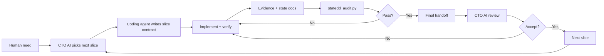
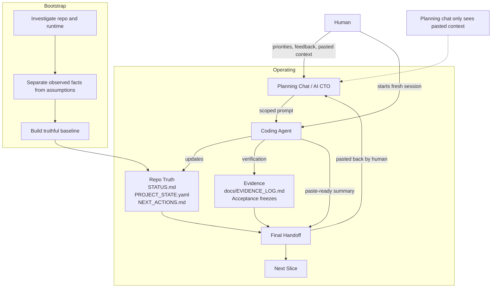

# StateDD Template

StateDD is a repo-based workflow for AI-assisted software projects.

It keeps project truth, next actions, evidence, runtime proof, and handoffs inside the repository so coding agents do not rely on stale chat context.

Current StateDD spec version: `statedd-template-v5`

The template repository itself uses `repo_role: template_repository` and
`statedd_mode: template-maintenance`. Repos generated or adopted from it use
`repo_role: downstream_project` and start in `statedd_mode: bootstrap`.

---

## Start here

New project:

```bash
python3 scripts/init_template.py new --name "Your Project" --profile solo
```

Existing repo:

```bash
python3 scripts/init_template.py adopt --name "Your Project" --dry-run
python3 scripts/init_template.py adopt --name "Your Project" --profile solo
```

Smallest footprint:

```bash
python3 scripts/init_template.py new --name "Your Project" --profile minimal
```

Then paste this into your coding agent:

```text
Read prompts/CODING_AGENT_STARTUP_PROMPT.md and follow it exactly.
```

Not sure which profile to choose? See `docs/ADOPTION_PROFILES.md`.  
Want all commands in one place? See `docs/QUICK_COMMANDS.md`.

## Start Simple

You do not need to use every StateDD feature on day one.

Start with:

- `STATUS.md`
- `PROJECT_STATE.yaml`
- `NEXT_ACTIONS.md`
- `BACKLOG.md`
- `scripts/check_state_docs.py`

Use runtime proof, evidence packs, acceptance freezes, and strict audit when the work needs stronger proof.

## Why This Exists

AI-assisted projects drift. Context decays, repo truth falls behind runtime truth, and important decisions disappear into chat history. Most workflow scaffolds fail because:

- the chat window becomes the only source of truth
- the repo claims things that were never verified
- screenshots are accepted even when the wrong runtime was open
- active work grows into a vague pile instead of a short queue
- inherited repos are forced into a greenfield workflow that does not fit

The State Driven Development Template reduces those failure modes with explicit state, evidence-backed claims, non-destructive adoption, and small implementation slices.

This repository publishes the template itself. It keeps the workflow contract public and reusable, but it does not try to use its own state files as a running diary for every small template maintenance edit. Downstream repos created from it should use the full workflow directly.

## Good Fit

- AI-assisted software projects that need durable repo truth outside the chat
- inherited or messy repos where discovery matters before implementation
- solo builders or teams that want cleaner handoffs between planning and coding
- projects where user-facing acceptance should be tied to evidence and runtime identity

## Not Ideal

- tiny throwaway scripts
- repos with no need for state, evidence, or handoff discipline
- zero-process playgrounds where long-term context does not matter

## What You Get

| File or path | Purpose |
| --- | --- |
| **`AGENTS.md`** | Operating contract and repo-mode rules |
| `STATUS.md` | Short human snapshot of current truth |
| **`PROJECT_STATE.yaml`** | Machine-checkable current truth |
| `PROJECT_DNA.yaml` | Stable architecture and governance contract |
| `PROJECT_ADAPTER.yaml` | Project-specific vocabulary and runtime adapter |
| **`NEXT_ACTIONS.md`** | Active queue only |
| `BACKLOG.md` | Medium-term roadmap with stable backlog IDs |
| `WORKLOG.md` | Append-only history |
| `LICENSE` | Custom free-use license with teaching rights reserved |
| `LICENSE_FAQ.md` | Plain-language license guide |
| `ANTI_BRITTLENESS_GUARD.md` | Reusable anti-brittleness review contract |
| **`docs/EVIDENCE_LOG.md`** | Proof ledger for user-facing claims |
| `docs/ACCEPTANCE_FREEZES.md` | Accepted milestone ledger |
| `docs/evidence/` | Default artifact root for screenshots, logs, and outputs |
| `docs/GETTING_STARTED_5_MIN.md` | Fast beginner path for first setup and first agent session |
| `docs/QUICK_COMMANDS.md` | Copy-paste command cheat sheet |
| `docs/ADOPTION_PROFILES.md` | How to choose `minimal`, `solo`, `team`, or `regulated` |
| `docs/WORKFLOW_FOR_BEGINNERS.md` | Beginner-friendly diagram, prompt map, and quality checklist |
| `docs/adr/` | Architecture decision records |
| `scripts/init_template.py` | Initialize a new repo or adopt the workflow into an existing repo |
| `scripts/check_state_docs.py` | Validate hygiene and bootstrap readiness |
| `scripts/statedd_version_check.py` | Verify StateDD spec-version alignment |
| `scripts/statedd_handoff.py` | Print a read-only handoff snapshot from local repo state |
| `scripts/statedd_audit.py` | Machine-checkable closure audit |
| `scripts/statedd_doctor.py` | Fast StateDD health summary |
| `scripts/statedd_worktree_guard.py` | Pre-slice/closure worktree isolation and dirty-file classification guard |
| `scripts/statedd_brittleness_check.py` | Advisory anti-brittleness heuristic scanner |
| `scripts/statedd_runtime_proof.py` | Capture `runtime_identity.json` proof artifacts for evidence folders |
| `scripts/statedd_validate_schema.py` | Validate StateDD state, evidence, runtime, and handoff contracts |
| `scripts/statedd_evidence_pack.py` | Create, hash, scan, and validate evidence pack manifests and redaction status |
| `scripts/statedd_upgrade.py` | Non-destructive downstream upgrade helper for managed template assets |
| `scripts/test_init_template.py` | Regression-check initializer safety |
| `scripts/test_worktree_guard.py` | Regression-check worktree guard behavior |
| `scripts/test_brittleness_check.py` | Regression-check brittleness scanner and audit marker behavior |
| `scripts/test_schema_validation.py` | Regression-check schema validation behavior |
| `scripts/test_evidence_pack.py` | Regression-check evidence pack manifest and redaction behavior |
| `schemas/` | Executable StateDD schemas and Markdown contracts |
| `schemas/examples/schema_prompt_loop/` | Concrete schema-driven example: one schema validates data and generates prompt material |
| `prompts/` | Startup prompts, CTO prompt, tool/model routing guide, handoff template, runtime checklist, freeze template, slice contract, evidence README, schema ownership, subagent review, CTO review checklist |

## How It Works

1. `bootstrap`: establish a truthful baseline by separating observed facts from assumptions.
2. plan: choose one small next backlog slice.
3. contract: write a slice contract with scope, non-goals, and acceptance criteria.
4. preflight: run `scripts/statedd_worktree_guard.py --mode start-slice` before non-trivial implementation.
5. execute: implement and verify directly.
6. record: update state and evidence when truth changes.
7. audit: run `statedd_audit.py` before claiming closure-grade.
8. handoff: leave the next session a clear starting point.
9. review: the CTO AI accepts, rejects, or conditions closure.

## What Makes This Different

- prove which runtime was actually under test before accepting behavior (`runtime identity proof`)
- freeze accepted milestones to source, runtime, and evidence (`acceptance freeze`)
- four-state closure: implemented, validated, closure-grade, and accepted are separate states
- `negative-search honesty`: a failed search stays `not found` or `not proven`; it does not become `never existed`
- executable audit: `statedd_audit.py` checks the repo rather than relying on agent discipline alone
- executable schemas: `statedd_validate_schema.py` checks state, evidence README, runtime identity, and handoff contracts
- `bootstrap vs operating`: discovery is a real phase, not a formality
- `adopt` path for inherited repos: bring the workflow into existing codebases without blindly overwriting them
- short active queue: open work stays small and backlog-linked

## Quick Start

The fastest path is `docs/GETTING_STARTED_5_MIN.md`. For a visual guide with a full prompt map, see `docs/WORKFLOW_FOR_BEGINNERS.md`.

### New Repo

```bash
python3 scripts/init_template.py new --name "Your Project" --profile solo
```

### Existing Repo

Preview adoption first:

```bash
python3 scripts/init_template.py adopt --name "Your Project" --dry-run
```

Then run the real adoption command:

```bash
python3 scripts/init_template.py adopt --name "Your Project" --profile solo
```

### First Session

1. If you cloned this template directly, remove `.git` and verify your new remote before any push.
2. Start OpenCode with `prompts/OPENCODE_STARTUP_PROMPT.md`, or another coding tool with `prompts/CODING_AGENT_STARTUP_PROMPT.md`.
3. Let the coding agent read `AGENTS.md`, `STATUS.md`, `PROJECT_STATE.yaml`, `PROJECT_DNA.yaml`, and `NEXT_ACTIONS.md`.
4. For non-trivial work, create a separate planning chat and paste `prompts/CTO_SESSION_PROMPT.md`.
5. If the repo is still in `bootstrap`, let the coding agent ask the minimum strategic questions first.
6. Before switching a repo to `operating`, run:

```bash
python3 scripts/check_state_docs.py --bootstrap-gate
```

## Git Safety

If you cloned this template directly, do not keep this repo's `.git` history for your own project. Reset it before any push:

```bash
rm -rf .git
git init
git add .
git commit -m "Initialize project from template"
git branch -M main
git remote add origin <your-repo-url>
git remote -v
```

## Setup Paths

Use `new` for a fresh scaffold and `adopt` for an existing codebase.

Typical paths:

```bash
python3 scripts/init_template.py new --name "Your Project" --profile solo
python3 scripts/init_template.py new --name "Your Project" --target ../your-project --profile solo
python3 scripts/init_template.py new --name "Your Project" --profile minimal
```

If a managed file already exists and replacement is intentional, review the collision first and only then consider `--force-overwrite`.

## Adopt An Existing Repo

Adoption is designed to be non-destructive by default:

- existing README preserved unless you explicitly add a link section
- workflow files are created without pretending unknowns are known
- `.github/` assets are only installed when requested
- conflicting managed files are not replaced unless you deliberately force it

Useful adoption commands:

```bash
python3 scripts/init_template.py adopt --name "Your Project" --dry-run
python3 scripts/init_template.py adopt --name "Your Project" --readme-link
python3 scripts/init_template.py adopt --name "Your Project" --install-github-assets
```

## Agent Read Order

Every fresh coding-agent session should start with `AGENTS.md`, `STATUS.md`, `PROJECT_STATE.yaml`, `PROJECT_DNA.yaml`, and `NEXT_ACTIONS.md`. Read `BACKLOG.md` and `WORKLOG.md` when planning or reviewing history.

## Bootstrap Completion Gate

Bootstrap is not complete just because the repo was inspected once. Before switching to `operating`, the repo should have a truthful `STATUS.md`, useful structured state, an active queue, and a real `BACKLOG.md`, not a placeholder.

Run the gate before flipping modes:

```bash
python3 scripts/check_state_docs.py --bootstrap-gate
```

## Versioning

`VERSION` is the canonical StateDD spec-version source. Version-bearing state, docs, and generator files must agree with it before handoff or release.

```bash
python3 scripts/statedd_version_check.py
```

## Setting Up The AI CTO Agent

For non-trivial work, separate planning from implementation. Use a planning chat, or AI CTO pattern, to reconstruct context, critique proposals, and scope the next slice. Use the coding agent to implement, verify, and update repo truth. The planning chat can be ChatGPT, Claude, Gemini, or another capable model. It does not have direct access to the repo or state files unless the human pastes context into it. Fresh handoffs and a fresh coding-agent session matter.

## Tool And Model Routing

The CTO lane should recommend tools, models, settings, and prompt shape when that choice materially affects quality, cost, speed, context fit, or verification risk. Use `prompts/TOOL_MODEL_ROUTING_GUIDE.md` for this.

Routing is dynamic. The CTO should ask what the user can actually access, weigh task risk against budget and context needs, and output a concrete setup such as planner/reviewer model, coding-agent model, reasoning effort or thinking mode, enabled tools, context strategy, fallback route, and paste-ready prompt.

Do not treat model catalogs as stable template truth. Specific claims about model capabilities, pricing, context windows, or tool support should be verified from current primary sources or marked as `reported`, `assumed`, or `not proven`.

## Prompt Files

The prompt files are the reusable source of truth for startup and handoff wording:

- `prompts/CODING_AGENT_STARTUP_PROMPT.md` — what a coding agent reads first
- `prompts/OPENCODE_STARTUP_PROMPT.md` — OpenCode-specific startup wording
- `prompts/CTO_SESSION_PROMPT.md` — how the CTO lane starts and reviews handoffs
- `prompts/BOOTSTRAP_INTAKE_PROMPT.md` — how to bootstrap a new project
- `prompts/TOOL_MODEL_ROUTING_GUIDE.md` — how to choose tools, models, and settings
- `prompts/FINAL_HANDOFF_TEMPLATE.md` — shape of the final handoff to the CTO lane
- `prompts/RUNTIME_IDENTITY_CHECKLIST.md` — verify which runtime is being tested
- `prompts/ACCEPTANCE_FREEZE_TEMPLATE.md` — freeze a user-facing milestone
- `prompts/SLICE_CONTRACT_TEMPLATE.md` — define scope, non-goals, and acceptance before coding
- `prompts/EVIDENCE_README_TEMPLATE.md` — claim ledger for every evidence folder
- `prompts/SCHEMA_OWNERSHIP_TEMPLATE.md` — canonical schema, examples, tests, and migration policy
- `prompts/SUBAGENT_REVIEW_TEMPLATE.md` — strict output format for subagent reviews
- `prompts/CTO_REVIEW_CHECKLIST.md` — repeatable CTO review after every handoff

| You are... | Open this prompt | Paste it into... |
| --- | --- | --- |
| Human starting a new project | `prompts/BOOTSTRAP_INTAKE_PROMPT.md` | CTO AI planning chat |
| CTO AI starting a review/planning session | `prompts/CTO_SESSION_PROMPT.md` | Planning chat |
| Coding agent starting work | `prompts/CODING_AGENT_STARTUP_PROMPT.md` or `prompts/OPENCODE_STARTUP_PROMPT.md` | Coding agent session |
| Coding agent before coding a slice | `prompts/SLICE_CONTRACT_TEMPLATE.md` | Evidence folder or `NEXT_ACTIONS.md` |
| Coding agent writing evidence | `prompts/EVIDENCE_README_TEMPLATE.md` | `docs/evidence/<slice>/README.md` |
| Coding agent final handoff | `prompts/FINAL_HANDOFF_TEMPLATE.md` | Handoff message to CTO chat |
| CTO AI reviewing a handoff | `prompts/CTO_REVIEW_CHECKLIST.md` | Planning chat reply |
| Checking UI/runtime identity | `prompts/RUNTIME_IDENTITY_CHECKLIST.md` | Verification step before acceptance |
| Freezing a milestone | `prompts/ACCEPTANCE_FREEZE_TEMPLATE.md` | `docs/ACCEPTANCE_FREEZES.md` |
| Choosing tools/models | `prompts/TOOL_MODEL_ROUTING_GUIDE.md` | CTO AI planning chat |
| Defining a schema contract | `prompts/SCHEMA_OWNERSHIP_TEMPLATE.md` | Schema design step |
| Using subagents | `prompts/SUBAGENT_REVIEW_TEMPLATE.md` | Subagent instructions |

## Final Handoff Template

Use `prompts/FINAL_HANDOFF_TEMPLATE.md`. The handoff should capture what changed, what was verified, repo path, branch, git head, process or container, endpoint, rebuild status, evidence refs, and the next recommended backlog slice.

Use `python3 scripts/statedd_handoff.py` near the end of a slice to print a local handoff snapshot. The helper is read-only and marks runtime facts as `not proven` unless they are directly captured.

## Runtime Identity Proof

Before accepting user-facing behavior, first prove which repo, branch, HEAD commit, process or container, and endpoint were actually under test, plus whether the artifact was rebuilt and whether duplicate runtimes were checked.

Use `python3 scripts/statedd_runtime_proof.py --evidence-dir docs/evidence/<slice> --url http://localhost:<port>` to write `runtime_identity.json` for runtime slices. For docs/scripts-only slices, use `python3 scripts/statedd_runtime_proof.py --no-runtime-required --evidence-dir docs/evidence/<slice>`.

StateDD requires browser-verification evidence for user-facing closure, not a specific browser automation provider. Kimi WebBridge is a preferred provider when available, not a required dependency. Acceptable providers include Playwright, agent-native browser tools, existing E2E/browser tests, manual browser screenshots with explicit limits, or custom project tooling, as long as the evidence is durable and linked to runtime identity.

## Acceptance Freezes

After a user-facing milestone is accepted, create an acceptance freeze tied to source, runtime identity, and evidence. Use `prompts/ACCEPTANCE_FREEZE_TEMPLATE.md` and store durable artifacts under `docs/evidence/`.

## Search Honesty

Negative searches stay negative. Use `not found`, `not currently locatable`, or `not proven`. A failed search does not justify claiming something never existed.

## Workflow Diagram

The loop is simple: bootstrap a truthful baseline, plan the next slice, execute and verify it, then hand off the next clean step. The planning chat only sees what the human pastes into it. Repo truth and evidence stay in the repository until the human or coding agent includes them in a handoff.





## Non-Trivial Work

Treat work as non-trivial when it changes multiple files, changes workflow or state structure, affects user-facing behavior, or is likely to take more than one prompt. In operating mode, scope that work as one backlog slice and run it through the planning chat plus a fresh coding-agent session.

Before non-trivial implementation, run the worktree preflight from the repo root:

```bash
pwd
git remote -v
git branch --show-current
git rev-parse HEAD
git fetch origin --prune
git status --short
git worktree list --porcelain
python3 scripts/statedd_worktree_guard.py --mode start-slice
```

If the guard reports dirty or ambiguous state, stop implementation and produce a
worktree recovery handoff. Use `python3 scripts/statedd_worktree_guard.py --mode classify-dirty`
to record dirty-file classifications in evidence before editing.

## Common Failure Modes

- the coding agent edits before reading the current state files
- bootstrap is treated as a formality instead of real discovery
- the planning chat is treated as if it can read the repo directly
- model/vendor preferences are hard-coded without checking available tools, task risk, cost limits, or current provider facts
- dirty shared worktrees allow local-only files to masquerade as progress
- brittle prompt/string/keyword/fixture-specific fixes are accepted without an invariant
- user-facing claims are made without evidence
- screenshots are accepted before runtime identity is proven
- a failed search is upgraded to a false certainty
- "implemented" is treated as "accepted"

## Executable Audit And State Doctor

StateDD v2 makes the workflow executable, not just descriptive.

```bash
python3 scripts/statedd_doctor.py       # fast health summary
python3 scripts/statedd_audit.py        # machine-checkable closure audit
```

`statedd_audit.py` checks required state files, evidence hygiene, git worktree cleanliness, branch/HEAD recording, user-facing evidence, runtime identity artifacts, schema validation, schema ownership, anti-brittleness markers, and test/build/lint recording. Use `--strict` to fail on warnings.

`statedd_doctor.py` prints a one-glance summary of HEAD, worktree, evidence, state-doc freshness, test/browser proof, runtime identity status, open blockers, next slice, and closure grade.

Run the full gate set before handoff, review, or release:

```bash
python3 scripts/check_state_docs.py
python3 scripts/statedd_validate_schema.py
python3 scripts/test_init_template.py
python3 scripts/test_worktree_guard.py
python3 scripts/test_brittleness_check.py
python3 scripts/test_runtime_proof.py
python3 scripts/test_schema_validation.py
python3 scripts/statedd_worktree_guard.py --mode start-slice
python3 scripts/statedd_doctor.py
python3 scripts/statedd_audit.py
```

## Slice Contracts And Claim Ledgers

Before coding, write a slice contract using `prompts/SLICE_CONTRACT_TEMPLATE.md`. It defines the scope, non-goals, acceptance criteria, worktree preflight, anti-brittleness gate, and escalation triggers so the agent does not wander into adjacent work.

Every evidence folder should contain a `README.md` claim ledger based on `prompts/EVIDENCE_README_TEMPLATE.md`. Each claim is tied to concrete proof.

For non-trivial fix or feature slices, complete `ANTI_BRITTLENESS_GUARD.md` or
`docs/quality_gates/ANTI_BRITTLENESS_GATE.md`. The optional
`scripts/statedd_brittleness_check.py` scan can warn about brittle shapes, but a
clean scan is not proof of quality.

## Schema Ownership

`prompts/SCHEMA_OWNERSHIP_TEMPLATE.md` enforces the rule: **No schema may exist only in prose.** Every packet schema needs a canonical machine-readable schema, generated example JSON, generated external prompt snippet, validation tests, an exact-shape sample, a `schemaVersion` field, and a migration policy.

## Evidence Pack Manifests And Redaction Gate

Every closure-grade evidence folder can include a `manifest.json` that lists:

- the backlog slice ID, branch, and HEAD the evidence belongs to
- claims with their supporting artifact paths
- artifacts with sha256 hashes and redaction status
- a redaction block recording automated scan results, manual review status, and known limits

Use `scripts/statedd_evidence_pack.py` to manage manifests:

```bash
python3 scripts/statedd_evidence_pack.py init docs/evidence/YYYY-MM-DD-slice --slice-id BL-012
python3 scripts/statedd_evidence_pack.py hash docs/evidence/YYYY-MM-DD-slice
python3 scripts/statedd_evidence_pack.py scan docs/evidence/YYYY-MM-DD-slice
python3 scripts/statedd_evidence_pack.py check docs/evidence/YYYY-MM-DD-slice
python3 scripts/statedd_evidence_pack.py check docs/evidence/YYYY-MM-DD-slice --strict
```

The redaction scanner is dependency-free and conservative. It flags obvious secret-like patterns but never claims that absence of findings proves absence of secrets. Binary and image artifacts always require explicit manual review or `checked_with_limits` status.

## Upgrading An Existing StateDD Repo

Use the upgrade helper to bring a downstream repo forward without overwriting project truth:

```bash
python3 scripts/statedd_upgrade.py /path/to/downstream/repo
python3 scripts/statedd_upgrade.py /path/to/downstream/repo --apply
python3 scripts/statedd_upgrade.py /path/to/downstream/repo --apply --force-managed
```

Default mode is dry-run. `--apply` copies only safe missing managed assets.
`--force-managed` may replace outdated safe template assets, but it never touches project-truth files such as `PROJECT_STATE.yaml`, `BACKLOG.md`, or `README.md`.

## Schema-Backed Validation

StateDD ships executable schemas under `schemas/` and validates them with the stdlib-only `scripts/statedd_validate_schema.py`.

The default validator checks:

- `PROJECT_STATE.yaml` role/mode truth, required state sections, evidence pointers, and active problem shape
- `PROJECT_DNA.yaml` version, product contract, truth rules, and invariants
- `PROJECT_ADAPTER.yaml` when present
- `docs/evidence/*/README.md` against the evidence README contract
- `docs/evidence/*/runtime_identity.json` against the runtime identity contract
- `prompts/FINAL_HANDOFF_TEMPLATE.md` when present

The evidence README contract is intentionally a minimal BL-012 seed. It checks required ledger headings and markers; it does not implement redaction scanning or full evidence-pack manifests.

## ADRs

Long-lived architecture decisions belong in `docs/adr/` rather than `STATUS.md`. Use `docs/adr/0000-adr-template.md` as the starting point.

## CTO Review Checklist

After every coding-agent handoff, the CTO lane answers the checklist in `prompts/CTO_REVIEW_CHECKLIST.md`: closure verdict, missing proof, contradictions, repo hygiene, worktree/source-of-truth visibility, anti-brittleness, product value, and next best slice.

## Human Override Rule

StateDD rules are strong defaults, not a prison. The human product owner may explicitly override a workflow step, but the agent must record the override as `Human override used: yes` and mark the result honestly. The agent cannot ignore you, but it also cannot pretend an overridden shortcut is clean closure. See `AGENTS.md`.

Remember: implemented ≠ validated ≠ closure-grade ≠ accepted.

## Validation

Run the hygiene check before handoff, review, or release:

```bash
python3 scripts/check_state_docs.py
python3 scripts/statedd_version_check.py
python3 scripts/statedd_validate_schema.py
python3 scripts/test_init_template.py
python3 scripts/test_worktree_guard.py
python3 scripts/test_brittleness_check.py
python3 scripts/test_schema_validation.py
python3 scripts/statedd_handoff.py
python3 scripts/statedd_doctor.py
python3 scripts/statedd_audit.py
```

You can also validate initialized fixtures or another repo copy:

```bash
python3 scripts/check_state_docs.py fixtures/bootstrap_dry_run/bootstrap
python3 scripts/statedd_validate_schema.py fixtures/bootstrap_dry_run/bootstrap
python3 scripts/check_state_docs.py fixtures/bootstrap_dry_run/operating
python3 scripts/statedd_validate_schema.py fixtures/bootstrap_dry_run/operating
python3 scripts/check_state_docs.py fixtures/messy_inherited_repo/bootstrap
python3 scripts/statedd_validate_schema.py fixtures/messy_inherited_repo/bootstrap
```

## Publishing A Downstream Project

Before publishing a repo created from this template:

1. Replace template-level project names and adapter values.
2. Make sure the downstream README reflects the real project.
3. Remove optional example material that does not belong in the public repo.
4. Re-run `python3 scripts/check_state_docs.py`.
5. Keep evidence and acceptance freeze artifacts durable and discoverable.

## Notes

- This template does not ship an application runtime.
- Start with `docs/GETTING_STARTED_5_MIN.md` if the full README feels heavy.
- The prompt files are the source of truth for reusable prompt wording.
- Deeper reference docs live in `docs/BOOTSTRAP_QUALITY.md` and `docs/README.md`.
- The project is released under a custom license in [`LICENSE`](LICENSE). You may use, modify, distribute, and profit from the Software, but teaching/training rights are reserved. See [`LICENSE_FAQ.md`](LICENSE_FAQ.md).
