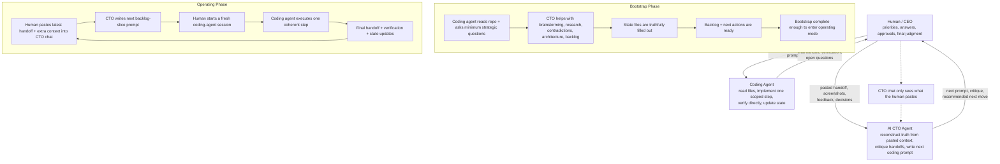

# State Driven Development Template

This repository is a public template for technical projects that want explicit
live state, evidence-backed claims, a short active queue, stable backlog IDs,
and clean handoffs.

It gives you a lightweight workflow for AI-assisted delivery built around
durable state files, evidence logs, backlog slices, and clean handoffs between
the human, the CTO lane, and the coding lane.

`README.md` is the primary user guide. `AGENTS.md`, `STATUS.md`,
`PROJECT_STATE.yaml`, `PROJECT_DNA.yaml`, `NEXT_ACTIONS.md`, `BACKLOG.md`,
`WORKLOG.md`, `docs/EVIDENCE_LOG.md`, and `docs/ACCEPTANCE_FREEZES.md` are the
durable workflow contract.

## What You Get

- `AGENTS.md`: operating contract and mode rules
- `STATUS.md`: short human snapshot of current truth
- `PROJECT_STATE.yaml`: structured machine-checkable current truth
- `PROJECT_DNA.yaml`: stable architecture and governance contract
- `PROJECT_ADAPTER.yaml`: project-specific vocabulary and runtime adapter
- `NEXT_ACTIONS.md`: active queue only
- `BACKLOG.md`: medium-term roadmap with stable backlog IDs
- `WORKLOG.md`: append-only history
- `docs/EVIDENCE_LOG.md`: proof ledger for user-facing claims
- `docs/ACCEPTANCE_FREEZES.md`: append-only ledger of accepted user-facing milestones
- `docs/evidence/`: default artifact root for screenshots, logs, and saved outputs
- `scripts/init_template.py`: use `new` to create a repo from the template, or `adopt` to add the workflow to an existing repo
- `scripts/check_state_docs.py`: hygiene validator plus `--bootstrap-gate`
- `prompts/`: optional prompt helpers for bootstrap, CTO review, and handoffs
- `fixtures/`: sample bootstrap/operating snapshots and inherited-repo edge cases
- `.github/`: optional issue templates, PR template, and CI validation workflow

## Workflow Modes

- `bootstrap`: use this when the repo is new, inherited, or unclear. The goal is to establish a complete truthful operating baseline before implementation mode begins.
- `operating`: use this only after bootstrap is complete. The project runs as a backlog-slice execution loop with short queues, explicit verification, and clean handoffs.

This template repository is maintained lightly as the published template.
Downstream repos created from it should start in `bootstrap` and use the full
workflow directly.

## Quick Start

1. If you are creating a new repo from this template, run `python3 scripts/init_template.py new --name "Your Project"`.
2. If you are adding the workflow to an existing codebase, run `python3 scripts/init_template.py adopt --name "Your Project"`.
3. If the repo came from a direct clone or copy, remove `.git` and verify `git remote -v` before any push.
4. Start your coding tool with `prompts/CODING_AGENT_STARTUP_PROMPT.md`.
5. Let the coding agent read `AGENTS.md`, `STATUS.md`, `PROJECT_STATE.yaml`, `PROJECT_DNA.yaml`, and `NEXT_ACTIONS.md`.
6. If the repo is still in `bootstrap`, let the coding agent ask the minimum strategic questions first.
7. Create a separate CTO chat in ChatGPT, Claude, Gemini, or another chatbot and paste `prompts/CTO_SESSION_PROMPT.md`.
8. Let the CTO lane define the next scoped coding-agent prompt and enforce the verification and handoff requirements.
9. Before flipping to operating mode, run `python3 scripts/check_state_docs.py --bootstrap-gate`.

## Git Safety

Do not keep this repository's current `.git` folder if you intend to publish
your own project.

If you cloned or copied this repo directly and keep the existing git metadata,
`git push` can still target this template repository instead of your own repo.

Typical local reset flow:

```bash
rm -rf .git
git init
git add .
git commit -m "Initialize project from template"
git branch -M main
git remote add origin <your-repo-url>
git remote -v
```

## Setup Paths

Use `new` when you want the full template scaffold. Use `adopt` when you want
to install only the workflow files into an existing codebase.

New repo from template:

```bash
python3 scripts/init_template.py new --name "Your Project Name"
```

New repo in a separate directory:

```bash
python3 scripts/init_template.py new --name "Your Project Name" --target ../your-project
```

Existing non-empty target with no collisions:

```bash
python3 scripts/init_template.py new --name "Your Project Name" --target ../your-project --overwrite
```

Minimal public-ready variant:

```bash
python3 scripts/init_template.py new --name "Your Project Name" --minimal
```

If a `new` target already contains conflicting template-managed paths, review
those files first. Use `--force-overwrite` only when replacement is intentional.

## Adopt An Existing Repo

`adopt` is a first-class path. It is not the same thing as `--overwrite`.

Default adoption behavior:

- install workflow/state files and helper assets without copying the full template tree blindly
- inspect the current repo and generate a first bootstrap baseline from observed manifests, entrypoints, deployment hints, and contradictions
- start the repo in `bootstrap` mode
- create non-destructive state files, backlog, worklog, and evidence files
- keep the existing README preserved by default
- leave `.github/` alone unless you explicitly request it

Preview what would happen:

```bash
python3 scripts/init_template.py adopt --name "Your Project Name" --dry-run
```

Adopt the current repo and append a short workflow section to the existing README:

```bash
python3 scripts/init_template.py adopt --name "Your Project Name" --readme-link
```

Adopt and also install optional GitHub assets:

```bash
python3 scripts/init_template.py adopt --name "Your Project Name" --install-github-assets
```

If workflow files already exist, adoption stays non-destructive unless you
deliberately use `--overwrite --force-overwrite`.

## Agent Read Order

The coding agent should start every repo session by reading:

1. `AGENTS.md`
2. `STATUS.md`
3. `PROJECT_STATE.yaml`
4. `PROJECT_DNA.yaml`
5. `NEXT_ACTIONS.md`

The human does not need to do this manual read-order step before the first
bootstrap intake. Read `BACKLOG.md` and `WORKLOG.md` when planning or reviewing
history.

## Bootstrap Completion Gate

Bootstrap is not complete just because the repo was inspected once.

Before switching to `operating`, the repo should have:

- a truthful `STATUS.md`
- a substantially filled `PROJECT_STATE.yaml`
- a stable enough `PROJECT_DNA.yaml` to guide implementation
- a meaningful `PROJECT_ADAPTER.yaml` when project vocabulary or runtime details matter
- an active `NEXT_ACTIONS.md`
- a real `BACKLOG.md`, not a placeholder
- evidence and history entries that explain what bootstrap established

Bootstrap should also include CTO work, not just coding-agent intake:

- brainstorming about what the project should become
- research and contradiction resolution
- architecture and delivery-shape decisions
- backlog shaping and prioritization
- deciding what implementation mode should attack first

Run this before flipping modes:

```bash
python3 scripts/check_state_docs.py --bootstrap-gate
```

That check is meant to fail while a repo is still placeholder-level. It should
pass only when bootstrap has become a real baseline.

## Setting Up The AI CTO Agent

This workflow works best when strategy and implementation are split.

- The AI CTO agent is a separate chat used for reconstruction, critique, prioritization, and writing the next coding-agent prompt.
- The coding agent edits files, runs checks, verifies directly, and updates state.
- The AI CTO agent can be ChatGPT, Claude, Gemini, or another capable chatbot. It does not need repo write access.

Important constraint:

- The CTO lane does not have direct access to the repo or state files unless you paste them into that chat.
- The CTO lane only sees what the human relays: handoffs, state excerpts, screenshots, feedback, and extra context.
- For non-trivial work, each loop should normally start a fresh coding-agent session.
- During initial bootstrap, the coding agent should usually go first.

If you start directly with a coding agent and no CTO lane exists yet, the coding
agent should ask you to provide one before continuing with non-trivial work.

## Prompt Files

The prompt files are the source of truth. The README explains the workflow; it
does not duplicate the prompt bodies.

- `prompts/CODING_AGENT_STARTUP_PROMPT.md`: copy-paste startup prompt for the coding agent when no CTO-scoped prompt exists yet
- `prompts/CTO_SESSION_PROMPT.md`: startup prompt for the CTO lane
- `prompts/BOOTSTRAP_INTAKE_PROMPT.md`: minimum-question bootstrap intake
- `prompts/FINAL_HANDOFF_TEMPLATE.md`: canonical end-of-session handoff shape
- `prompts/RUNTIME_IDENTITY_CHECKLIST.md`: prove which runtime is actually being evaluated
- `prompts/ACCEPTANCE_FREEZE_TEMPLATE.md`: freeze an accepted user-facing milestone to source, runtime, and evidence

This cuts drift: update the prompt files when prompt wording changes.

## Final Handoff Template

Use `prompts/FINAL_HANDOFF_TEMPLATE.md` when the coding agent ends a session.

The final handoff should always include:

- what changed
- what was directly verified
- repo path
- branch
- what remains partial or risky
- git head
- process or container serving the verified artifact
- port or endpoint used for verification
- whether the running artifact was rebuilt in this slice
- clean worktree status
- evidence references
- absolute file paths for evidence artifacts when available
- next recommended action
- paste-ready wording for the CTO chat

## Runtime Identity Proof

Before accepting user-facing behavior, or before investigating a “this used to
look different” report, first prove runtime identity.

Minimum runtime identity proof:

- repo path or source tree path
- branch
- HEAD commit
- process or container serving the artifact
- port, base URL, or endpoint under test
- whether the artifact was rebuilt or restarted in this slice
- whether duplicate runtimes or stale build artifacts were checked

This prevents drift between screenshot truth, git truth, and runtime truth.
If your app can expose a commit hash in a dev footer or `/api/version`, do it.

## Acceptance Freezes

After a user-facing milestone is accepted, create an acceptance freeze.

Record:

- accepted scope
- repo path, branch, and HEAD
- runtime identity
- routes covered
- evidence refs
- regression guard for later work

Use `prompts/ACCEPTANCE_FREEZE_TEMPLATE.md` and store the result in
`docs/ACCEPTANCE_FREEZES.md` or another durable repo artifact.

## Search Honesty

Negative searches stay negative.

Use:

- `not found`
- `not currently locatable`
- `not proven`

Do not convert a failed search into `never existed`. That is a logic error, not
an acceptable shortcut.

## Workflow Diagram



## Non-Trivial Work

Treat work as non-trivial if any of these are true:

- it changes more than one file
- it changes architecture, workflow rules, or state structure
- it affects user-facing behavior or project instructions
- it touches integrations, migrations, or environment assumptions
- it is important enough that a bad change would distort future agent context
- it is likely to take more than one implementation prompt

Tiny isolated edits can be done without a CTO pass. Anything ambiguous should
default to the CTO lane.

If the tool supports subagents or parallel workers and the task would clearly
benefit, the CTO can encourage that explicitly. It is optional guidance, not a
core workflow requirement.

## Operating Loop

Once bootstrap is complete:

1. Keep `STATUS.md` short and current.
2. Put structured live truth in `PROJECT_STATE.yaml`.
3. Keep `NEXT_ACTIONS.md` limited to active open work.
4. Reference stable backlog IDs from `BACKLOG.md` inside `NEXT_ACTIONS.md`.
5. Let the CTO lane choose the next backlog slice or small related group of backlog items.
6. Paste the latest coding-agent final handoff and extra context into the CTO chat.
7. Start a fresh coding-agent session from the new CTO prompt.
8. Move completed history to `WORKLOG.md`.
9. Back every user-facing claim with direct evidence and store artifacts under `docs/evidence/` when possible.

## Common Failure Modes

- the coding agent starts editing before reading the current state files
- the user is told to manually do the read order instead of letting the coding agent do it
- the generated contract drifts from the live contract
- bootstrap is treated as a quick formality instead of a real discovery-and-planning phase
- the repo switches to `operating` before the state files and backlog are truthfully ready
- `NEXT_ACTIONS.md` contains work that is not linked to backlog IDs
- the CTO chat is treated as if it can read the repo directly even though it only sees pasted context
- user-facing claims are made without evidence in `docs/EVIDENCE_LOG.md`
- evidence artifacts are saved ad hoc instead of under `docs/evidence/`
- screenshots are treated as enough even though runtime identity was never proven
- a negative search result is upgraded into `never existed`
- accepted screens are not frozen to a commit, runtime, and evidence set

If you see any of these, stop and repair the workflow before continuing.

## Single-Agent Fallback

Using both a CTO lane and a coding lane is the preferred setup.

If you only have one AI tool available:

1. Start with a strategy-only pass.
2. Ask it to reconstruct truth, identify risk, and help finish bootstrap before implementation mode.
3. Only after that, ask it to implement the scoped backlog slice.
4. Before ending the session, make it produce a separate final handoff pass using `prompts/FINAL_HANDOFF_TEMPLATE.md`.

## Example Flow

Minimal new-repo example:

1. Run `python3 scripts/init_template.py new --name "Acme API"`.
2. Start the coding agent with `prompts/CODING_AGENT_STARTUP_PROMPT.md`.
3. Let the coding agent read the repo contract, inspect the repo, and ask the minimum bootstrap questions.
4. Create a CTO chat and paste `prompts/CTO_SESSION_PROMPT.md`.
5. Paste the coding agent's bootstrap handoff using `prompts/FINAL_HANDOFF_TEMPLATE.md`.
6. Use the CTO lane to complete research, architecture framing, and the first real backlog.
7. Give the CTO agent's next scoped prompt to a fresh coding-agent session.
8. Run `python3 scripts/check_state_docs.py --bootstrap-gate` before switching to `operating`.

Minimal adoption example:

1. Run `python3 scripts/init_template.py adopt --name "Inherited Service" --dry-run`.
2. Review the preview, then run the real adopt command.
3. Keep the existing product README authoritative and use the workflow files for bootstrap control.
4. Resolve contradictions before assuming inherited docs are true.

## When To Edit Which File

| File | Edit it when |
| --- | --- |
| `AGENTS.md` | the operating contract or repo mode changes |
| `STATUS.md` | the high-level truth snapshot changes |
| `PROJECT_STATE.yaml` | structured current truth changes |
| `PROJECT_DNA.yaml` | stable architecture or governance changes |
| `PROJECT_ADAPTER.yaml` | project vocabulary, runtime defaults, or integration names change |
| `NEXT_ACTIONS.md` | active open work changes |
| `BACKLOG.md` | medium-term priorities change |
| `WORKLOG.md` | a meaningful session completes |
| `docs/EVIDENCE_LOG.md` | you verified a user-facing claim |
| `docs/ACCEPTANCE_FREEZES.md` | a user-facing or operator-facing milestone is accepted |

## Validation

Run the hygiene check before handoff, PR review, or release:

```bash
python3 scripts/check_state_docs.py
```

Use the bootstrap gate before flipping a repo to operating mode:

```bash
python3 scripts/check_state_docs.py --bootstrap-gate
```

You can also validate a different initialized copy or fixture:

```bash
python3 scripts/check_state_docs.py fixtures/bootstrap_dry_run/bootstrap
python3 scripts/check_state_docs.py fixtures/bootstrap_dry_run/operating
python3 scripts/check_state_docs.py fixtures/messy_inherited_repo/bootstrap
```

GitHub Actions runs the same validation on pushes and pull requests. The
workflow also dry-runs `new`, `adopt`, overwrite-safe, overwrite-collision, and
`--minimal` modes.

## Repo Layout

- Root: live state, contract, roadmap, and history files
- `docs/`: evidence, rubric material, and durable workflow notes
- `scripts/`: initialization and validation helpers
- `prompts/`: text prompts for bootstrap, CTO review, and handoffs
- `fixtures/`: sample outputs for dry runs and inherited-repo edge cases
- `.github/`: optional templates and CI helpers

## Publishing A Downstream Project

Before you publish a repo created from this template:

1. Replace the template-level project name and adapter values.
2. Make sure the README reflects the real project once the workflow guide is no longer enough.
3. Remove optional examples with `--minimal` or manually delete `fixtures/` if they do not belong in the public repo.
4. Re-run `python3 scripts/check_state_docs.py`.
5. Make sure user-facing claims in the repo have evidence entries and durable artifact placement under `docs/evidence/` when possible.

## Notes

- This template does not ship an application runtime.
- Supplemental rubric material lives in `docs/BOOTSTRAP_QUALITY.md` and `docs/README.md`.
- The project is released under the MIT license in [`LICENSE`](LICENSE).
