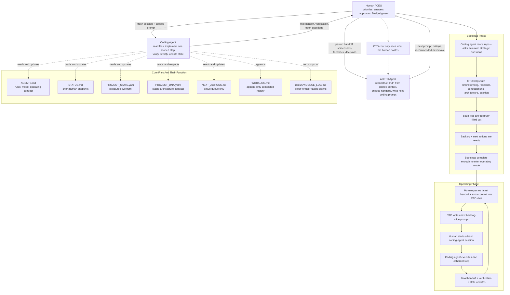

# State-Driven Development Template

This repository is a public template for technical projects that want explicit
live state, evidence-backed claims, a short active queue, and clean handoffs.

`README.md` is the complete user guide for using the template. The other files
are the operating system itself.

## What You Get

- `AGENTS.md`: operating contract and mode rules
- `STATUS.md`: short human snapshot of current truth
- `PROJECT_STATE.yaml`: structured machine-checkable current truth
- `PROJECT_DNA.yaml`: stable architecture and governance contract
- `PROJECT_ADAPTER.yaml`: project-specific vocabulary and runtime adapter
- `NEXT_ACTIONS.md`: active queue only
- `BACKLOG.md`: medium-term roadmap
- `WORKLOG.md`: append-only history
- `docs/EVIDENCE_LOG.md`: proof ledger for user-facing claims
- `scripts/init_template.py`: stamps a copied repo or creates a fresh initialized copy
- `scripts/check_state_docs.py`: validates the live-state document boundaries
- `prompts/`: optional prompt helpers for bootstrap, CTO review, and coding-agent delegation
- `fixtures/`: example bootstrap/operating snapshots and an adversarial inherited repo
- `.github/`: issue templates, PR template, and CI validation workflow

## Workflow Modes

- `bootstrap`: use this when the repo is new, inherited, or unclear. The goal is to establish a complete truthful operating baseline before implementation mode begins.
- `operating`: use this only after bootstrap is complete. The project runs as a backlog-slice execution loop with short queues, explicit verification, and clean handoffs.

This template repository is itself maintained in `operating` mode.
Repos created from the template should start in `bootstrap`.

## Quick Start

1. Create a new repo from this template, or clone/copy it locally.
2. Initialize the copy with your project name using the safe path that matches your situation.
3. Start your coding agent with the coding-agent startup prompt from this README.
4. Let the coding agent read the repo files in order, notice that the repo is in `bootstrap` mode, and ask you the minimum strategic questions needed.
5. After that first bootstrap intake, set up the CTO lane in ChatGPT, Claude, Gemini, or another chatbot using `prompts/CTO_SESSION_PROMPT.md`.
6. Use the coding-agent handoff plus your answers as the first CTO input, then let the CTO help complete bootstrap.
7. Do not enter implementation mode until the state files and a real backlog are filled out enough to truthfully guide work.

## Git Safety

Do not keep this repository's current `.git` folder if you intend to publish your own project.

If you cloned or copied this repo directly and keep the existing git metadata, `git push` can still target this template repository instead of your own repo. That is not the intended setup.

Safe options:

1. Preferred: use GitHub's "Use this template" flow so your new repo gets its own git history and remote.
2. Local copy: remove `.git`, create a fresh repo, and add your own remote before you ever push.

Typical local reset flow:

```bash
rm -rf .git
git init
git add .
git commit -m "Initialize project from state-driven development template"
git branch -M main
git remote add origin <your-repo-url>
```

If you are unsure, run `git remote -v` before every first push and make sure it points to your own repository.

Initialize the current copy in place:

```bash
python3 scripts/init_template.py --name "Your Project Name"
```

Initialize a fresh directory directly from this checkout:

```bash
python3 scripts/init_template.py --name "Your Project Name" --target ../your-project
```

Create the smallest public-ready variant:

```bash
python3 scripts/init_template.py --name "Your Project Name" --minimal
```

`--minimal` removes `fixtures/` and `docs/BOOTSTRAP_QUALITY.md` after initialization.

## First 10 Minutes

If you want the shortest reliable setup path, do exactly this:

1. Run `python3 scripts/init_template.py --name "Your Project Name"`.
2. If this repo came from a direct clone or copy, remove `.git` and create your own git remote before pushing.
3. Open `README.md`.
4. Open your coding tool and paste the coding-agent startup prompt from the section below.
5. Let the coding agent read `AGENTS.md`, `STATUS.md`, `PROJECT_STATE.yaml`, `PROJECT_DNA.yaml`, and `NEXT_ACTIONS.md`.
6. If the repo is in `bootstrap` mode and project intent is still unclear, let the coding agent ask you the minimum strategic questions needed before implementation.
7. Create a separate CTO chat in ChatGPT, Claude, Gemini, or another chatbot.
8. Paste the CTO startup prompt from the section below into that chat.
9. Paste the coding agent's first bootstrap handoff plus your answers into the CTO chat.
10. Use the CTO lane to help with brainstorming, research, contradictions, architecture, and backlog shaping until bootstrap is truthfully complete.
11. Only then start the operating loop from a CTO prompt aimed at a backlog slice.
12. After changes, run `python3 scripts/check_state_docs.py`.
13. Do not switch to `operating` mode until bootstrap truth is actually established.

## What The Init Script Does

- copies the template scaffold when `--target` points at a different directory
- stamps the managed state files with your project name
- sets the initialized repo to `repo_mode: bootstrap`
- keeps the README, scripts, prompts, and GitHub automation in place
- prints the next exact steps

If `--target` points at an existing non-empty directory outside the current checkout,
use `--overwrite` for safe non-conflicting writes and `--force-overwrite` only
after reviewing collisions you intentionally want to replace.

## Safe Initialization Paths

Use the init script differently depending on what already exists:

1. Copied template checkout: run `python3 scripts/init_template.py --name "Your Project Name"` in place.
2. Fresh empty directory: run `python3 scripts/init_template.py --name "Your Project Name" --target ../your-project`.
3. Existing non-empty directory with no conflicting template paths: run `python3 scripts/init_template.py --name "Your Project Name" --target ../your-project --overwrite`.
4. Existing non-empty directory with conflicting files such as `README.md`, `AGENTS.md`, or `.github/workflows/validate.yml`: stop, back up or review those files first, then use `--force-overwrite` only if you intentionally want the template versions to replace them.

`--overwrite` is now collision-aware. It allows writing into a non-empty target only when the directory does not already contain conflicting template-managed paths. This protects inherited repos from accidentally losing an existing `README.md`, workflow file, or state doc.

## Agent Read Order

The coding agent should start every repo session by reading:

1. `AGENTS.md`
2. `STATUS.md`
3. `PROJECT_STATE.yaml`
4. `PROJECT_DNA.yaml`
5. `NEXT_ACTIONS.md`

The human does not need to do this manual read-order step before the first bootstrap intake.
Read `BACKLOG.md` and `WORKLOG.md` when planning or reviewing history.

## Bootstrap Completion Gate

Bootstrap is not complete just because the repo was inspected once.

Before switching to `operating`, the repo should have:

- a truthful `STATUS.md`
- a substantially filled `PROJECT_STATE.yaml`
- a stable enough `PROJECT_DNA.yaml` to guide implementation
- a meaningful `PROJECT_ADAPTER.yaml` when project vocabulary or runtime details matter
- an active `NEXT_ACTIONS.md`
- a real `BACKLOG.md`, not a placeholder
- enough evidence and history entries to explain what was established during bootstrap

Bootstrap should also include CTO work, not just coding-agent intake:

- brainstorming about what the project should become
- research and contradiction resolution
- architecture and delivery-shape decisions
- backlog shaping and prioritization
- deciding what implementation mode should attack first

Do not switch to `operating` until those pieces are truthfully present.

## Setting Up The AI CTO Agent

This workflow works best when strategy and implementation are split.

- The AI CTO agent is a separate chat used for reconstruction, critique, prioritization, and writing the next coding-agent prompt.
- The coding agent is the tool that edits files, runs checks, and updates state.
- The AI CTO agent can be ChatGPT, Claude, Gemini, or another capable chatbot. It does not need repo write access.
- The coding agent can be Codex, Codex CLI, Claude Code, Gemini CLI, or another repo-writing tool that can read files, edit files, and run verification commands.

Important constraint:

- The CTO lane does not have direct access to the repo or state files unless you paste them into that chat.
- The CTO lane only sees what the human relays: handoffs, state excerpts, screenshots, feedback, and extra context.
- For non-trivial work, each loop should normally start a fresh coding-agent session rather than relying on old chat context.
- During initial bootstrap, the coding agent should usually go first: it reads the repo contract, sees `bootstrap` mode, and asks the minimum strategic questions needed before the CTO loop fully takes over.
- Bootstrap is a shared CTO + coding-agent phase. The CTO lane should help with brainstorming, research, contradiction resolution, architecture framing, and backlog shaping before implementation mode begins.

Recommended setup:

1. Open a separate chat in your preferred chatbot.
2. Paste the full contents of `prompts/CTO_SESSION_PROMPT.md` as the startup prompt.
3. Give that chat repo context by pasting `STATUS.md`, `PROJECT_STATE.yaml`, screenshots, feedback, and the latest coding-agent handoff when needed.
4. Use that CTO chat to decide the next move and produce the next implementation prompt.
5. Start a fresh coding-agent session with that scoped prompt.

If you start directly with a coding agent and no CTO lane exists yet, the coding agent should stop and ask you to provide one before continuing with non-trivial work.

A valid CTO handoff should usually include:

- the current verified truth and any explicit unknowns
- the single coherent scope for the next implementation step
- constraints or risks that must not be ignored
- required verification or evidence
- an exit condition for the handoff

If the CTO lane cannot produce that level of specificity yet, the next step is usually more investigation, not implementation.

The CTO prompt should also remind the coding agent to follow `AGENTS.md` and to end with one final handoff message that can be pasted back into the CTO chat.
For operating-mode work, the CTO prompt should usually target one backlog slice or a small set of tightly related backlog items.
If the coding tool supports subagents and the task benefits from parallel work, the CTO should explicitly encourage using them.

The main operating explanation stays in this README. The prompt files are support material, not the primary documentation.

## Workflow Diagram



Read the diagram like this:

- bootstrap is a broader discovery-and-planning phase with both the coding lane and CTO lane involved
- operating is a human-relayed loop between the CTO chat and fresh coding-agent sessions
- the human stays in the loop for priorities, corrections, approvals, and context transfer
- the CTO chat does not automatically see the repo or state files
- the files are the durable memory layer that keeps the agents from drifting over time

### Copy-Paste CTO Startup Prompt

Paste this into a separate strategy chat:

```text
You are my CTO and product-architecture lead for this project.

You are not the coding agent.
Your job is to reconstruct truth, review handoffs critically, protect architecture, choose the next highest-leverage move, and write the next coding-agent prompt when appropriate.

You do not have direct access to the repo or state files unless I paste them here.
Assume you only know what I paste into this chat.

Operate in a truth-first way:
- do not overclaim
- separate verified facts from assumptions
- call out contradictions, missing proof, and brittle sequencing
- prefer one coherent next step over broad vague plans

When I paste state, handoffs, or repo details:
1. summarize the real current state
2. identify what is verified, partial, risky, or missing
3. tell me the single best next move
4. if appropriate, write the next coding-agent prompt

During bootstrap, help with:
- brainstorming what the project should become
- research and contradiction resolution
- architecture framing
- backlog design and prioritization
- deciding when the repo is complete enough to enter operating mode

When you write a coding-agent prompt, include:
- the exact scope
- the constraints that matter
- the files or systems that should be inspected first
- the required verification or evidence
- the condition for being done
- a reminder to follow `AGENTS.md`
- a requirement to end with one final handoff message I can paste back to you

In operating mode, aim prompts at one backlog slice or a very small set of tightly related backlog items.
If the coding tool supports subagents and the task would benefit, encourage using them explicitly.

Assume each coding-agent run is a fresh session.
Restate any context that is not safely preserved in repo state files.
```

### Copy-Paste Coding-Agent Startup Prompt

Paste this into your coding tool at the start of a repo session:

```text
Read these files first in order:
1. AGENTS.md
2. STATUS.md
3. PROJECT_STATE.yaml
4. PROJECT_DNA.yaml
5. NEXT_ACTIONS.md

Then follow the repo contract exactly.

If the repo is in bootstrap mode and the project intent is still unclear, do not start implementing yet.
First ask the user only the minimum strategic questions needed to establish what the project should become.

If no CTO lane or CTO handoff exists yet and the task is non-trivial, stop and ask me to provide one before continuing.

Treat work as non-trivial if it includes any of:
- multiple-file changes
- architecture or workflow changes
- user-facing behavior
- migrations, integrations, or state-structure changes
- anything likely to require more than one implementation prompt

Do not overclaim. Verify directly. Update state/docs when truth changes.
In operating mode, assume the task should usually be a backlog slice unless the prompt explicitly says otherwise.
If your coding tool supports subagents and the task can be parallelized safely, use them when that is clearly beneficial.
At the end of the session, stop and provide one final handoff message I can paste to the CTO agent.
```

### Copy-Paste Bootstrap Kickoff Prompt

Use this with the CTO agent when starting a new repo or inherited repo:

```text
We already completed the first bootstrap intake with the coding agent for this repository.

Use the pasted handoff and my answers to reconstruct truthful baseline state.
Help me complete bootstrap, not rush into implementation.
If anything critical is still missing, ask only the minimum follow-up questions needed.
Help with brainstorming, research, contradictions, architecture, and backlog shaping as needed.
Then produce the best next coding-agent prompt for the next bootstrap step.
```

## Bootstrap Procedure

When a new project starts, do this in order:

1. Investigate the host system and runtime.
2. Investigate the repo structure and actual implementation reality.
3. Ask only the minimum strategic questions needed.
4. Use the CTO lane to help with brainstorming, research, contradictions, architecture, and backlog shaping.
5. Update the state files with observed truth and explicit unknowns.
6. Prepare a real `BACKLOG.md` and the first short active queue in `NEXT_ACTIONS.md`.
7. Record evidence for any user-facing claims in `docs/EVIDENCE_LOG.md`.
8. Flip `repo_mode` to `operating` only when the baseline and backlog are actually established.
9. Append the outcome to `WORKLOG.md`.

If something is not proven, label it honestly as `observed`, `unknown`, `reported`,
`assumed`, `blocked`, `stale`, or `invalid`.

## Non-Trivial Work

The CTO lane is mandatory for non-trivial work.

Treat work as non-trivial if any of these are true:

- it changes more than one file
- it changes architecture, workflow rules, or state structure
- it affects user-facing behavior or project instructions
- it touches integrations, migrations, or environment assumptions
- it is important enough that a bad change would distort future agent context
- it is likely to take more than one implementation prompt

Tiny isolated edits can be done without a CTO pass, but anything ambiguous should default to using the CTO lane.
If a task starts as trivial and expands beyond that boundary, pause and route it back through the CTO lane before continuing.

## Operating Loop

Once bootstrap is complete:

1. Keep `STATUS.md` short and current.
2. Put structured live truth in `PROJECT_STATE.yaml`.
3. Put stable architecture assumptions in `PROJECT_DNA.yaml`.
4. Keep only open work in `NEXT_ACTIONS.md`.
5. Let the CTO lane choose the next backlog slice or small related group of backlog items.
6. Paste the latest coding-agent final handoff and any extra context into the CTO chat.
7. Start a fresh coding-agent session from the new CTO prompt.
8. Move completed history to `WORKLOG.md`.
9. Back every user-facing claim with direct evidence and end implementation sessions with a final handoff that includes usable evidence paths.

## Common Failure Modes

These are the mistakes this template is meant to prevent:

- the coding agent starts editing before reading the current state files
- the user is told to manually read the repo state instead of letting the coding agent do the required read order
- the CTO lane is started before the first bootstrap intake even though the coding agent should first read the repo and ask the minimum strategic questions
- bootstrap is treated as a quick formality instead of a real discovery-and-planning phase
- the repo switches to `operating` before the state files and backlog are truthfully ready
- the project has no CTO lane, so implementation happens without critique or sequencing
- the CTO chat is treated as if it can read the repo directly even though it only sees pasted context
- the same coding-agent session is stretched too long and starts relying on stale chat memory
- `STATUS.md` becomes stale and stops matching the repo
- `NEXT_ACTIONS.md` turns into a backlog instead of a short active queue
- user-facing claims are made without evidence in `docs/EVIDENCE_LOG.md`
- the repo flips to `operating` too early, before the baseline truth is established
- agents keep re-adding features, assumptions, or architecture that already changed

If you see any of these, stop and repair the workflow before continuing implementation.

## Single-Agent Fallback

Using both a CTO lane and a coding lane is the preferred setup.

If you only have one AI tool available:

1. Start with a strategy-only pass.
2. Ask it to reconstruct truth, identify risk, and help finish bootstrap before implementation mode.
3. Only after that, ask it to implement the scoped backlog slice.
4. Before ending the session, make it produce a separate final handoff pass with evidence paths and update state/evidence.

This is less reliable than using a separate CTO chat, but it is still better than jumping straight into implementation.

## Example Flow

Minimal example for a new repo:

1. Run `python3 scripts/init_template.py --name "Acme API"`.
2. Start the coding agent with the coding-agent startup prompt from this README.
3. The coding agent reads the state files, notices `bootstrap` mode, inspects the repo, and asks you only the minimum strategic questions needed.
4. Create a CTO chat and paste the CTO startup prompt from this README.
5. Paste the coding agent's bootstrap handoff plus your answers into the CTO chat.
6. Use the CTO lane to help complete research, architecture framing, and the first real backlog.
7. Give the CTO agent's next scoped prompt to a fresh coding-agent session.
8. Repeat until the repo has a truthful baseline and a ready backlog, then switch to `operating`.

If the coding agent tries to skip the CTO lane for non-trivial work, that is a workflow error, not a productivity shortcut.

## When To Edit Which File

| File | Edit it when |
| --- | --- |
| `AGENTS.md` | the operating contract or repo mode changes |
| `STATUS.md` | the high-level truth snapshot changes |
| `PROJECT_STATE.yaml` | structured current truth changes |
| `PROJECT_DNA.yaml` | stable architecture or governance changes |
| `PROJECT_ADAPTER.yaml` | project vocabulary, runtime defaults, or integration names change |
| `NEXT_ACTIONS.md` | active open work changes |
| `BACKLOG.md` | medium-term priorities change |
| `WORKLOG.md` | a meaningful session completes |
| `docs/EVIDENCE_LOG.md` | you verified a user-facing claim |

## Validation

Run the hygiene check before handoff, PR review, or release:

```bash
python3 scripts/check_state_docs.py
```

You can also validate a different initialized copy or fixture:

```bash
python3 scripts/check_state_docs.py fixtures/bootstrap_dry_run/bootstrap
python3 scripts/check_state_docs.py fixtures/bootstrap_dry_run/operating
python3 scripts/check_state_docs.py fixtures/messy_inherited_repo/bootstrap
```

GitHub Actions runs the same validation on pushes and pull requests. The workflow
also dry-runs the initializer in normal, overwrite-safe, overwrite-collision, and `--minimal` modes.

## Repo Layout

- Root: live state, contract, roadmap, and history files
- `docs/`: durable evidence and rubric material
- `scripts/`: initialization and validation helpers
- `prompts/`: optional text prompts for bootstrap, CTO review, and coding-agent delegation
- `fixtures/`: sample outputs for dry runs and inherited-repo edge cases
- `.github/`: issue templates, PR template, and CI workflow

## Publishing A Downstream Project

Before you publish a repo created from this template:

1. Replace the template-level project name and adapter values.
2. Make sure the README reflects the real project once the workflow guide is no longer enough.
3. Remove optional examples with `--minimal` or manually delete `fixtures/` if they do not belong in the public repo.
4. Re-run `python3 scripts/check_state_docs.py`.
5. Make sure user-facing claims in the repo have evidence entries.

## Notes

- This template does not ship an application runtime.
- Supplemental rubric material lives in `docs/BOOTSTRAP_QUALITY.md` and `docs/README.md`.
- The project is released under the MIT license in [`LICENSE`](LICENSE).
