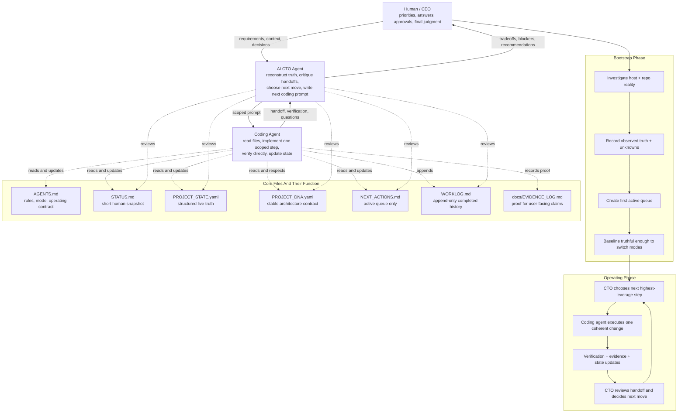

# Truth-First Project Operating System Template

This repository is a public template for technical projects that want explicit
live state, evidence-backed claims, a short active queue, and clean handoffs.

`README.md` is the complete user guide for using the template. The other files
are the operating system itself.

## What You Get

- `AGENTS.md`: operating contract and mode rules
- `STATUS.md`: short human snapshot of current truth
- `PROJECT_STATE.yaml`: structured machine-checkable current truth
- `PROJECT_DNA.yaml`: stable architecture and governance contract
- `PROJECT_ADAPTER.yaml`: project-specific vocabulary and runtime adapter
- `NEXT_ACTIONS.md`: active queue only
- `BACKLOG.md`: medium-term roadmap
- `WORKLOG.md`: append-only history
- `docs/EVIDENCE_LOG.md`: proof ledger for user-facing claims
- `scripts/init_template.py`: stamps a copied repo or creates a fresh initialized copy
- `scripts/check_state_docs.py`: validates the live-state document boundaries
- `prompts/`: optional prompt helpers for bootstrap, CTO review, and coding-agent delegation
- `fixtures/`: example bootstrap/operating snapshots and an adversarial inherited repo
- `.github/`: issue templates, PR template, and CI validation workflow

## Workflow Modes

- `bootstrap`: use this when the repo is new, inherited, or unclear. The goal is to establish truthful baseline state.
- `operating`: use this after bootstrap is complete. The project runs steady-state with short queues, explicit verification, and clean handoffs.

This template repository is itself maintained in `operating` mode.
Repos created from the template should start in `bootstrap`.

## Quick Start

1. Create a new repo from this template, or clone/copy it locally.
2. Initialize the copy with your project name.
3. Set up an AI CTO agent in ChatGPT, Claude, Gemini, or another chatbot using `prompts/CTO_SESSION_PROMPT.md`.
4. Read the files in the required order.
5. Bootstrap the real project truth.
6. Run the validation script before handoff or publishing changes.

## Git Safety

Do not keep this repository's current `.git` folder if you intend to publish your own project.

If you cloned or copied this repo directly and keep the existing git metadata, `git push` can still target this template repository instead of your own repo. That is not the intended setup.

Safe options:

1. Preferred: use GitHub's "Use this template" flow so your new repo gets its own git history and remote.
2. Local copy: remove `.git`, create a fresh repo, and add your own remote before you ever push.

Typical local reset flow:

```bash
rm -rf .git
git init
git add .
git commit -m "Initialize project from truth-first template"
git branch -M main
git remote add origin <your-repo-url>
```

If you are unsure, run `git remote -v` before every first push and make sure it points to your own repository.

Initialize the current copy in place:

```bash
python3 scripts/init_template.py --name "Your Project Name"
```

Initialize a fresh directory directly from this checkout:

```bash
python3 scripts/init_template.py --name "Your Project Name" --target ../your-project
```

Create the smallest public-ready variant:

```bash
python3 scripts/init_template.py --name "Your Project Name" --minimal
```

`--minimal` removes `fixtures/` and `docs/BOOTSTRAP_QUALITY.md` after initialization.

## First 10 Minutes

If you want the shortest reliable setup path, do exactly this:

1. Run `python3 scripts/init_template.py --name "Your Project Name"`.
2. If this repo came from a direct clone or copy, remove `.git` and create your own git remote before pushing.
3. Open `README.md`.
4. Create a separate CTO chat in ChatGPT, Claude, Gemini, or another chatbot.
5. Paste the CTO startup prompt from the section below into that chat.
6. Open your coding tool and paste the coding-agent startup prompt from the section below.
7. Make sure the coding agent reads `AGENTS.md`, `STATUS.md`, `PROJECT_STATE.yaml`, `PROJECT_DNA.yaml`, and `NEXT_ACTIONS.md`.
8. Ask the CTO agent for the first bootstrap prompt.
9. Give that scoped prompt to the coding agent.
10. After changes, run `python3 scripts/check_state_docs.py`.
11. Do not switch to `operating` mode until bootstrap truth is actually established.

## What The Init Script Does

- copies the template scaffold when `--target` points at a different directory
- stamps the managed state files with your project name
- sets the initialized repo to `repo_mode: bootstrap`
- keeps the README, scripts, prompts, and GitHub automation in place
- prints the next exact steps

If `--target` points at an existing non-empty directory outside the current checkout,
pass `--overwrite` to allow the script to write into it.

## Required Read Order

Start every session by reading:

1. `AGENTS.md`
2. `STATUS.md`
3. `PROJECT_STATE.yaml`
4. `PROJECT_DNA.yaml`
5. `NEXT_ACTIONS.md`

Read `BACKLOG.md` and `WORKLOG.md` when planning or reviewing history.

## Setting Up The AI CTO Agent

This workflow works best when strategy and implementation are split.

- The AI CTO agent is a separate chat used for reconstruction, critique, prioritization, and writing the next coding-agent prompt.
- The coding agent is the tool that edits files, runs checks, and updates state.
- The AI CTO agent can be ChatGPT, Claude, Gemini, or another capable chatbot. It does not need repo write access.

Recommended setup:

1. Open a separate chat in your preferred chatbot.
2. Paste the full contents of `prompts/CTO_SESSION_PROMPT.md` as the startup prompt.
3. Give that chat repo context by pasting `STATUS.md`, `PROJECT_STATE.yaml`, and relevant handoffs when needed.
4. Use that CTO chat to decide the next move and produce the next implementation prompt.
5. Send that scoped prompt to your coding agent.

If you start directly with a coding agent and no CTO lane exists yet, the coding agent should stop and ask you to provide one before continuing with non-trivial work.

The main operating explanation stays in this README. The prompt files are support material, not the primary documentation.

## Workflow Diagram



Read the diagram like this:

- bootstrap is for establishing truthful baseline context
- operating is the repeating loop between CTO agent and coding agent
- the human stays in the loop for priorities, corrections, and approval
- the files are the durable memory layer that keeps the agents from drifting over time

### Copy-Paste CTO Startup Prompt

Paste this into a separate strategy chat:

```text
You are my CTO and product-architecture lead for this project.

You are not the coding agent.
Your job is to reconstruct truth, review handoffs critically, protect architecture, choose the next highest-leverage move, and write the next coding-agent prompt when appropriate.

Operate in a truth-first way:
- do not overclaim
- separate verified facts from assumptions
- call out contradictions, missing proof, and brittle sequencing
- prefer one coherent next step over broad vague plans

When I paste state, handoffs, or repo details:
1. summarize the real current state
2. identify what is verified, partial, risky, or missing
3. tell me the single best next move
4. if appropriate, write the next coding-agent prompt
```

### Copy-Paste Coding-Agent Startup Prompt

Paste this into your coding tool at the start of a repo session:

```text
Read these files first in order:
1. AGENTS.md
2. STATUS.md
3. PROJECT_STATE.yaml
4. PROJECT_DNA.yaml
5. NEXT_ACTIONS.md

Then follow the repo contract exactly.

If no CTO lane or CTO handoff exists yet and the task is non-trivial, stop and ask me to provide one before continuing.

Treat work as non-trivial if it includes any of:
- multiple-file changes
- architecture or workflow changes
- user-facing behavior
- migrations, integrations, or state-structure changes
- anything likely to require more than one implementation prompt

Do not overclaim. Verify directly. Update state/docs when truth changes.
```

### Copy-Paste Bootstrap Kickoff Prompt

Use this with the CTO agent when starting a new repo or inherited repo:

```text
We are starting bootstrap for this repository.

Help me establish truthful baseline state.
Ask only the minimum strategic questions needed.
Then produce the best next coding-agent prompt for the first bootstrap step.
```

## Bootstrap Procedure

When a new project starts, do this in order:

1. Investigate the host system and runtime.
2. Investigate the repo structure and actual implementation reality.
3. Ask only the minimum strategic questions needed.
4. Update the state files with observed truth and explicit unknowns.
5. Create the first short active queue in `NEXT_ACTIONS.md`.
6. Record evidence for any user-facing claims in `docs/EVIDENCE_LOG.md`.
7. Flip `repo_mode` to `operating` when baseline truth is actually established.
8. Append the outcome to `WORKLOG.md`.

If something is not proven, label it honestly as `observed`, `unknown`, `reported`,
`assumed`, `blocked`, `stale`, or `invalid`.

## Non-Trivial Work

The CTO lane is mandatory for non-trivial work.

Treat work as non-trivial if any of these are true:

- it changes more than one file
- it changes architecture, workflow rules, or state structure
- it affects user-facing behavior or project instructions
- it touches integrations, migrations, or environment assumptions
- it is important enough that a bad change would distort future agent context
- it is likely to take more than one implementation prompt

Tiny isolated edits can be done without a CTO pass, but anything ambiguous should default to using the CTO lane.

## Operating Loop

Once bootstrap is complete:

1. Keep `STATUS.md` short and current.
2. Put structured live truth in `PROJECT_STATE.yaml`.
3. Put stable architecture assumptions in `PROJECT_DNA.yaml`.
4. Keep only open work in `NEXT_ACTIONS.md`.
5. Have the AI CTO agent review state, handoffs, and the next move before large implementation steps.
6. Move completed history to `WORKLOG.md`.
7. Back every user-facing claim with direct evidence.
8. End implementation sessions with a handoff and hygiene check.

## Common Failure Modes

These are the mistakes this template is meant to prevent:

- the coding agent starts editing before reading the current state files
- the project has no CTO lane, so implementation happens without critique or sequencing
- `STATUS.md` becomes stale and stops matching the repo
- `NEXT_ACTIONS.md` turns into a backlog instead of a short active queue
- user-facing claims are made without evidence in `docs/EVIDENCE_LOG.md`
- the repo flips to `operating` too early, before the baseline truth is established
- agents keep re-adding features, assumptions, or architecture that already changed

If you see any of these, stop and repair the workflow before continuing implementation.

## Single-Agent Fallback

Using both a CTO lane and a coding lane is the preferred setup.

If you only have one AI tool available:

1. Start with a strategy-only pass.
2. Ask it to reconstruct truth, identify risk, and write the next implementation prompt.
3. Only after that, ask it to implement the scoped step.
4. Before ending the session, make it do a separate handoff pass and update state/evidence.

This is less reliable than using a separate CTO chat, but it is still better than jumping straight into implementation.

## Example Flow

Minimal example for a new repo:

1. Run `python3 scripts/init_template.py --name "Acme API"`.
2. Create a CTO chat and paste the CTO startup prompt from this README.
3. Tell the CTO agent: "We are starting bootstrap for Acme API. Give me the first coding-agent prompt."
4. Give that prompt to the coding agent.
5. The coding agent reads the state files, inspects the repo, updates `STATUS.md` and `PROJECT_STATE.yaml`, and records unknowns honestly.
6. The CTO agent reviews the resulting handoff and decides the next best step.
7. Repeat until the repo has a truthful baseline, then switch to `operating`.

If the coding agent tries to skip the CTO lane for non-trivial work, that is a workflow error, not a productivity shortcut.

## When To Edit Which File

| File | Edit it when |
| --- | --- |
| `AGENTS.md` | the operating contract or repo mode changes |
| `STATUS.md` | the high-level truth snapshot changes |
| `PROJECT_STATE.yaml` | structured current truth changes |
| `PROJECT_DNA.yaml` | stable architecture or governance changes |
| `PROJECT_ADAPTER.yaml` | project vocabulary, runtime defaults, or integration names change |
| `NEXT_ACTIONS.md` | active open work changes |
| `BACKLOG.md` | medium-term priorities change |
| `WORKLOG.md` | a meaningful session completes |
| `docs/EVIDENCE_LOG.md` | you verified a user-facing claim |

## Validation

Run the hygiene check before handoff, PR review, or release:

```bash
python3 scripts/check_state_docs.py
```

You can also validate a different initialized copy or fixture:

```bash
python3 scripts/check_state_docs.py fixtures/bootstrap_dry_run/bootstrap
python3 scripts/check_state_docs.py fixtures/bootstrap_dry_run/operating
python3 scripts/check_state_docs.py fixtures/messy_inherited_repo/bootstrap
```

GitHub Actions runs the same validation on pushes and pull requests. The workflow
also dry-runs the initializer in both normal and `--minimal` modes.

## Repo Layout

- Root: live state, contract, roadmap, and history files
- `docs/`: durable evidence and rubric material
- `scripts/`: initialization and validation helpers
- `prompts/`: optional text prompts for bootstrap, CTO review, and coding-agent delegation
- `fixtures/`: sample outputs for dry runs and inherited-repo edge cases
- `.github/`: issue templates, PR template, and CI workflow

## Publishing A Downstream Project

Before you publish a repo created from this template:

1. Replace the template-level project name and adapter values.
2. Make sure the README reflects the real project once the workflow guide is no longer enough.
3. Remove optional examples with `--minimal` or manually delete `fixtures/` if they do not belong in the public repo.
4. Re-run `python3 scripts/check_state_docs.py`.
5. Make sure user-facing claims in the repo have evidence entries.

## Notes

- This template does not ship an application runtime.
- The design guidance for repo-authored docs lives in `DESIGN.md`.
- The project is released under the MIT license in [`LICENSE`](LICENSE).
